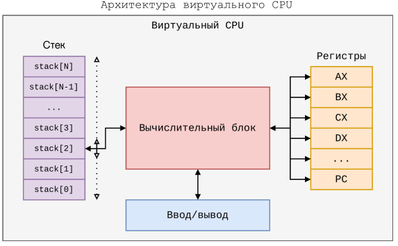
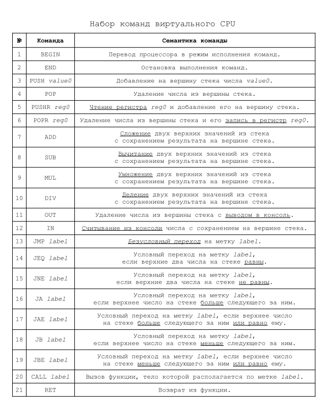

# Эмулятор виртуального CPU

Эта программа эмулирует виртуальный CPU, архитектура которого показана на следующем рисунке:



Виртуальный CPU имеет следующий набор команд:



## Правила написания программ для эмулятора

Значением value0 может быть любое 32-битное целое число со знаком.

Значением reg0 будет символ 'R' и номер регистра (R0 - R255).

Значением label в команде может быть любая последовательность символов без пробелов.

Команда помечается меткой, за которой сразу идет двоеточие, 
после которого должен идти хотя бы один пробельный символ, например:
```
    LABEL1: BEGIN
    LABEL2:
            PUSH 1
            JMP LABEL1
```

При недопустимых операциях на стеке эмулятор выведет сообщение об ошибке
и прекратит выполнение программы.

Арифметические команды выталкивают из стека два числа, и затем помещают на стек результат.

Команды условного перехода выталкивают из стека два числа.

Команда CALL помещает на стек адрес возврата (адрес следующей команды после CALL).
Поэтому подпрограмма должна вернуть стек в первоначальное состояние перед выходом.
Аргументы в подпрограмму можно передавать через регистры.

Команда RET переходит по адресу, лежащему на вершине стека.

Можно писать комментарии. Комментарий начинается либо с символа `/`, либо с символа `;`. 
Все что идет после этих символов на текущей строке игнорируется.

## Байт-код

Всего 21 команда. Для их кодирования достаточно 5 бит, выделим под код команды один байт.

Пусть команды в нашем эмуляторе будут иметь разный размер, в зависимости от типа.

Первый байт любой команды будет содержать код команды.

Команды без операнда будут иметь размер 1 байт (только код команды).

Команды, у которых операнд регистр, будут состоять из двух байтов (во втором байте номер регистра). 
Так как под регистры выделен 1 байт, то можно закодировать 256 разных регистра.

Команды с метками будут состоять из трех байт. Два байта выделим под адрес, в который будет преобразована символьная метка. 
Это ограничивает размер программы 65536 байтами, но мы пока не собираемся писать больших программ.

Команда PUSHR value0 будет состоять из пяти байтов. Четыре байта предназначены для
четырехбайтового целого числа.

Первые два байта байт-кода содержат адрес точки входа (инструкции BEGIN).

## Утилиты эмулятора

Эмулятор состоит из четырех исполняемых файлов.

Утилита **stack_test** запускает юнит-тестирование класса **Stack**. Для ее запуска нужно ввести команду
```
    ./lib/stack/bin/test
```

При успешном прохождении всех тестов будет выведено сообщение `All tests passed!`.

Утилита **emu** запускает эмулятор в режиме интерпретации. На вход подается текстовый файл,
который сразу выполняется, без создания файла с байт-кодом. Например, если программа находится в файле
**programs/fib.txt**, то нужно ввести команду
```
    ./bin/emu programs/fib.txt
```

Утилита **emu_comp** предназначена для компиляции текстовой программы в байт-код. 
На вход подается текстовый файл, на выходе создается файл с байт-кодом. 
Например, если программа находится в файле **programs/fib.txt**, и нужно сохранить байт-код 
в файл **bin/fib.bin**, то нужно ввести команду
```
    ./bin/emu_comp programs/fib.txt bin/fib.bin
```

Утилита **emu_exec** предназначена выполнения скомпилированной программы. 
На вход подается файл с байт-кодом. Например, если программа находится **bin/fib.bin**, 
то нужно ввести команду
```
    ./bin/emu_exec bin/fib.bin
```

## Примеры программ

Программа **fib.txt** предназначена для нахождения первых 40 чисел Фибоначчи:

```
;
; Программа выводит первые 40 чисел Фибоначчи (последовательность A000045)
;
    BEGIN

    ; Положить 39 в R255
    PUSH 39
    POPR R255
L0:
    ; Печатать первые 2 числа
    PUSH 0
    OUT
    PUSH 1    
    OUT

    PUSH 0  ; N0
    PUSH 1  ; N1
L1:
    ; Начало цикла, на стеке два предыдущих числа
    POPR R0     ; Положить большее число в R0
    PUSHR R0
    
    ADD         ; Сложить два предыдущих числа
    POPR R1     ; Положить результат в R1    

    PUSHR R0    ; Положить на стек предыдущее большее число
    PUSHR R1    ; Положить на стек текущее большее число
    OUT         ; Вывести последнее число
    PUSHR R1
L2:
    ; Условие завершения (ноль в регистре R255)
    ; Вычесть 1 из R255
    PUSH 1
    PUSHR R255
    SUB

    ; Сохранить уменьшенное значение
    POPR R255    
    PUSHR R255

    ; Сравнить с нулем
    PUSH 0

    ; Перейти в начало цикла, если R255 > 0
    JB L1

    END
```

Программа выводит следующую последовательность:

```
0
1
1
2
3
5
8
13
21
34
55
89
144
233
377
610
987
1597
2584
4181
6765
10946
17711
28657
46368
75025
121393
196418
317811
514229
832040
1346269
2178309
3524578
5702887
9227465
14930352
24157817
39088169
63245986
102334155
```

Программа **fact.txt** предназначена для нахождения факториала числа:

```
;
; Программа вычисления факториала.
; Вводит число с клавиатуры, вычисляет факториал,
; и выводит результат на экран.
; Допустимый ввод: числа в диапазоне [1 - 12],
; при больших числах результат не помещается в 32 бита.
;
    BEGIN

    ; Ввод числа
    IN
    POPR R0

    PUSHR R0
    POPR R255   ; Результат в R255
    PUSHR R0    ; В R0 текущий множитель
L1:
    ; Проверка условия выхода (множитель равен 1)
    ; Текущий множитель на вершине стека
    PUSH 1
    JEQ EXIT
L2:
    ; Вычесть из множителя 1
    PUSH 1
    PUSHR R0
    SUB

    ; Сохранить текущий множитель в R0
    POPR R0
    PUSHR R0    

    ; Умножить текущий множитель на текущий результат
    PUSHR R255
    MUL

    ; Сохранить текущий результат в R255
    POPR R255
    ; Положить текущий множитель на стек
    PUSHR R0

    ; Перейти в начало цикла
    JMP L1
EXIT:
    ; Извлечь результат из регистра
    PUSHR R255
    ; Вывести на экран
    OUT
    END
```

Программа **rfact.txt** предназначена для нахождения факториала числа с использованием рекурсивной функции:


```
;
; Программа вычисления факториала.
; Вводит число с клавиатуры, вычисляет факториал,
; и выводит результат на экран.
; Допустимый ввод: числа в диапазоне [1 - 12],
; при больших числах результат не помещается в 32 бита.
;


; Рекурсивная функция вычисления факториала
; Аргумент передается в регистре R1.
; Результат возвращается в регистре R0.
FACT:    
    ; Условие выхода из рекурсии (R1 == 1)
    PUSHR R1
    PUSH 1
    JEQ RETURN

    ; Помещаем аргумент на стек (понадобится позже)
    PUSHR R1

    ; Вычесть 1 из R1
    PUSH 1
    PUSHR R1
    SUB
    POPR R1    

    ; Вызвать функцию рекурсивно для аргумента меньшего на единицу
    CALL FACT
    ; Умножить результат (R0) на аргумент (который сейчас на вершине стека)
    PUSHR R0    
    MUL
    POPR R1

RETURN:
    ; Выход из функции, помещаем результат в R0
    PUSHR R1
    POPR R0
    RET

; Точка входа в программу
    BEGIN

    ; Ввод числа
    IN

    ; Помещаем число в R1 (аргумент функции)
    POPR R1

    ; Вызов рекурсивной функции
    CALL FACT
    
    ; Помещаем результат на стек
    PUSHR R0
    
    ; Вывод числа
    OUT

    END
```